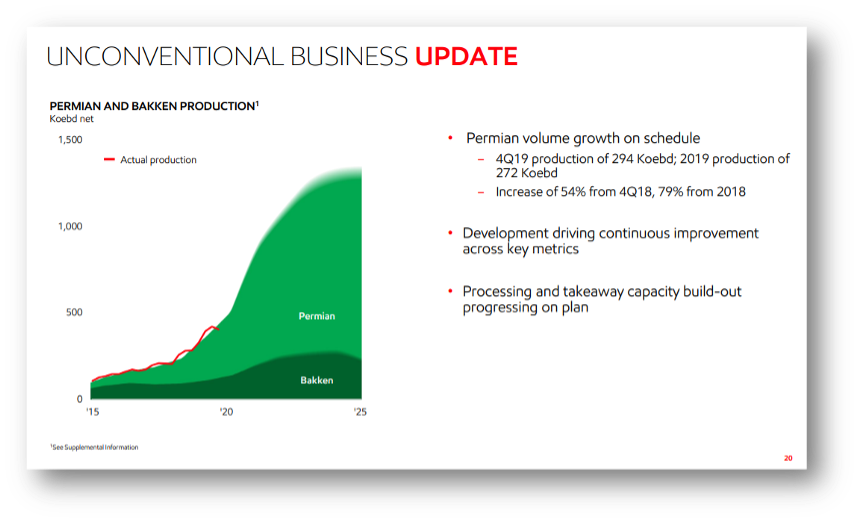
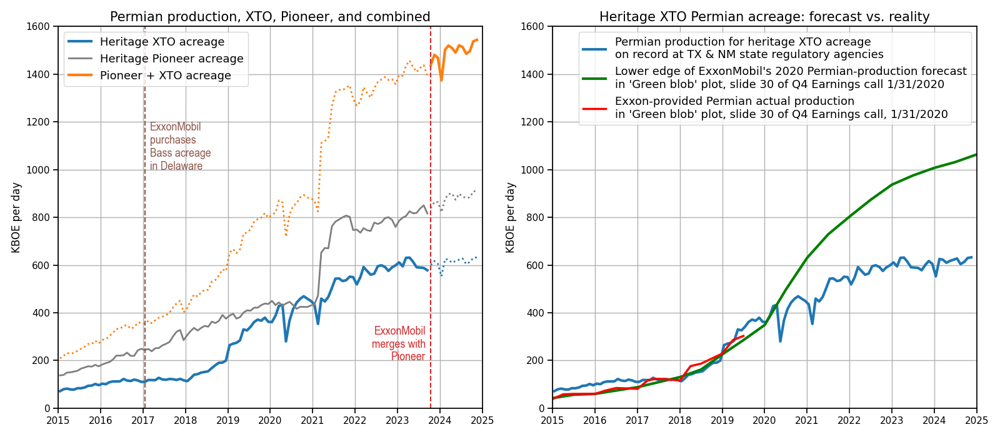

# Evaluating ExxonMobil's Permian Production Projections
Lindsey Gulden, February 2025

## What's in this folder?
This set of scripts and figures compares ExxonMobil's 2020-era Permian-production projections to what actually happened. Included here are links to data sources, processing scripts, and figure-generating code.

### Permian oil and gas production data recorded with state regulators
We queried publicly available oil and gas production data from the states of New Mexico and Texas to estimate ExxonMobil's Permian basin petroleum production both before and after its merger with Pioneer in late 2023. We tracked 'heritage XTO' acreage in the Permian to assess the 2020-era projections of ExxonMobil regarding Permian production in 2025.

#### Texas state regulator oil and gas data
From the Texas Railroad Commission's public database, we queried operator-total monhtly production for each month from January 2017 through November 2024 for both XTO ENERGY INC. and PIONEER NATURAL RES. USA, INC. We queried production for the four oil and gas districts in Texas that contain 'Permian' acreage (8, 8A, 7B, and 7C). For districts 8, 8A, 7B, and 7C, ExxonMobil was not listed under any registration as an operator/producer. A map of the districts can be found [here](https://rrc.texas.gov/media/3bkhbut0/districts_color_8x11.pdf).

ExxonMobil does business in the Texas Permian as the Exxon Mobil Corp subsidiary XTO ENERGY INC. Pioneer, which does business as 'PIONEER NATURAL RES. USA, INC' in Texas, only had production reported in districts 8, 8A, and 7C (none in 7B during the time period queried).
Data are publicly accessible at http://webapps.rrc.texas.gov/PDQ/generalReportAction.do. For each operator, and each district, we queried the district-total production for each month since January 2015 and assembled the data into a single dataframe (`texas_rrc_district_query_raw.csv`).

In the 'monthly' view of results for the General Production Query for a given operator (e.g., XTO ENERGY INC.), a given date range (e.g., Jan 2015 to Nov 2024) and District ID (e.g., District 7C), the Texas Railroad Commission reports the following volumes:
1. Oil produced, in units of barrels (bbl)
2. Casinghead (CH) gas (i.e., gas disolved in crude oil or condensate), in units of thousands of cubic feed (Mcf)
3. Gas well (GW) gas, which is gas produced in wells for which the dominant petroleum product is natural gas rather than oil, in units of Mcf.
4. Condensate, which is effectively 'light' oil, in units of bbls

#### New Mexico state regulator oil and gas data
From the New Mexico Oil Conservation Division (OCD), we obtained the production data for the two Exxon Mobil Corporation subsidiaries operating in the state of New Mexico, XTO ENERGY INC and XTO PERMIAN OPERATING LLC. Pioneer produced nothing in the state of NM between the years 2019 and 2024, which were the only years for which data were available on the OCD website as of February 2, 2025. Monthly oil production data (in units of bbls) and gas production data (in units of MCF) data are reported in the C-115 Summary Balancing Reports, which are publicly accessible at https://wwwapps.emnrd.nm.gov/OCD/OCDPermitting/Reporting/Production/C115BalancingSummary.aspx. The reports provide statewide total production for a given operator. As of Feburary 2, 2025, data were available for all months in years 2019-2023 and for the first 11 months of 2024.

The New Mexico OCD reports the following volumes for a given operator for each month listed in the C-115 Summary Balancing Reports:
1. Oil produced, in units of barrels (bbl)
2. Gas produced, in units of thousands of cubic feet (Mcf)
3. Additional information about the volume of oil and gas transported, as well as the 'variance' (?)

### How did we define the 'Permian'?
We used ExxonMobil's [maps of its Permian acreage](https://corporate.exxonmobil.com/who-we-are/our-global-organization/business-divisions/upstream/unconventional), combined with the [Texas Railroad Commission's maps of oil and gas districts](https://rrc.texas.gov/media/3bkhbut0/districts_color_8x11.pdf) to help identify which RRC districts span the Permian (oil and gas districts 8, 8A, and 7C span the majority of the Permian; the far western area in 7B could conceivably be considered the Permian)

The most accessible New Mexico data--the C-115 summary reports--provide production data that are aggregated across the entire state. In the state of New Mexico, it appears that both 'XTO Permian Operating LLC' and 'XTO Energy Inc.' operate Permian assets. XTO Permian Operating LLC began reporting production in mid 2019, which is when ExxonMobil/XTO began producing in Eddy and Lea counties in earnest. We assume here that most of ExxonMobil's oil and gas operations in the state of New Mexico are centered in the Permian and therefore treat the state-wide totals for both  'XTO Permian Operating LLC' and 'XTO Energy Inc.' as a good approximation of ExxonMobil NM Permian production. Pioneer does not operate in New Mexico.

### Data processing for state data
To enable comparison to values reported in ExxonMobil press releases and investor communications, which are typically provided in units of 'barrels of oil equivalent', we converted all gas production volumes for both Texas and New Mexico to 'barrels of oil equivalent' (boe) by dividing the number of thousand cubic feed of gas by 6, as is customary.

## Observations/Notes
1. In an October 11, 2023, press release announcing its acquisition of Pioneer Natural Resources, ExxonMobil stated, "At close, ExxonMobil’s Permian production volume would more than double to 1.3 million barrels of oil equivalent per day (MOEBD), based on 2023 volumes, and is expected to increase to approximately 2 MOEBD in 2027." We used this assertion to confirm that the data we collected are consistent with ExxonMobil's view of its own production.
2. We note that ExxonMobil drilled a few wells in the Delaware basin in 2017, began to ramp up Delaware drilling in 2018, and drilled in earnest in 2019. This [IEEFA review](https://ieefa.org/wp-content/uploads/2021/06/ExxonMobil-Permian-Leader-or-Just-Another-Fracker_June-2021.pdf) provides a review of post-Bass-acreage-acquisition performance of ExxonMobil assets. (It also contains a good map of the Permian basin)

## Digitizing ExxonMobil's Permian-production 'Green blob' images
 The following is slide 30 in the deck used for ExxonMobil's 4Q earnings call for investors, held January 31, 2020.

We used the freely available [Plot Digitizer app](https://plotdigitizer.com/app) to digitize data provided to investors in January 2020, detailing future Permian production (on what are toda
y 'heritage XTO' acres). For both the actual-production time series (shown in red) and the Permian production, we subtracted the digitized Bakken production from the digitized actual-production data and the projection of future production through 2025 (known as the 'green blob').

# Data and postprocessing scripts and figure-generating code
1. Digitized ExxonMobil projection (and actuals) data as well as NM OC and Texas RRC Permian production data for both Pioneer and XTO are available in this [zipped directory](https://drive.google.com/file/d/1PyYGjHnSSJuoxyak0OCEW5OBVhdzSgU9/view?usp=share_link).
2. [cleaned_data.py](https://github.com/lindseygulden/leg-up/blob/main/projects/permian/clean_data.py) is a script that converted the raw query results to a cleaner, easier to manage dataframe (written to the '_postprocessed.csv' files in the linked data directory above.
3. This [Permian Production jupyter notebook](https://github.com/lindseygulden/leg-up/blob/main/projects/permian/permian_production.ipynb) does additional postprocessing on the digitized data and query results, then plots the two-paneled image below.

# Difference between 2020 production forecast and actuals
We formatted the above-described data such that all time series could be plotted together for comparison. The figure shows the results:

# What is the value of the discrepancy?
We generated a hypothetical case in which the total production differences between the 'Green Blob' forecast and the actual production quickly returned to zero by the end of 2028. 
Assuming a discount rate of 8% and a profit of $20/BOE, we computed the NPV of the 'missing production' in the gap between the 2020 Green Blob forecast and the actual production from the heritage XTO acreage: the NPV of the 665.7 million BOE of 'missing production' is $10.3 billion.
